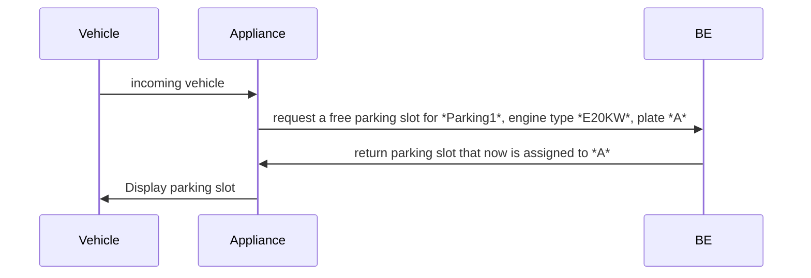
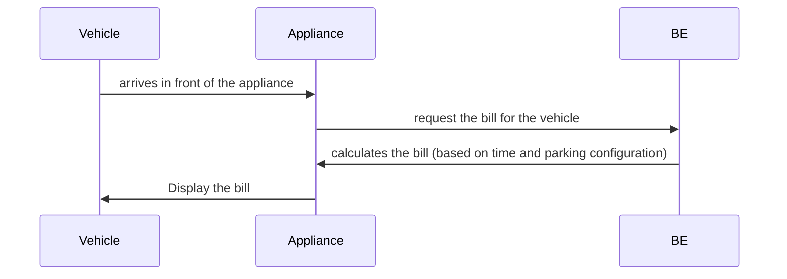
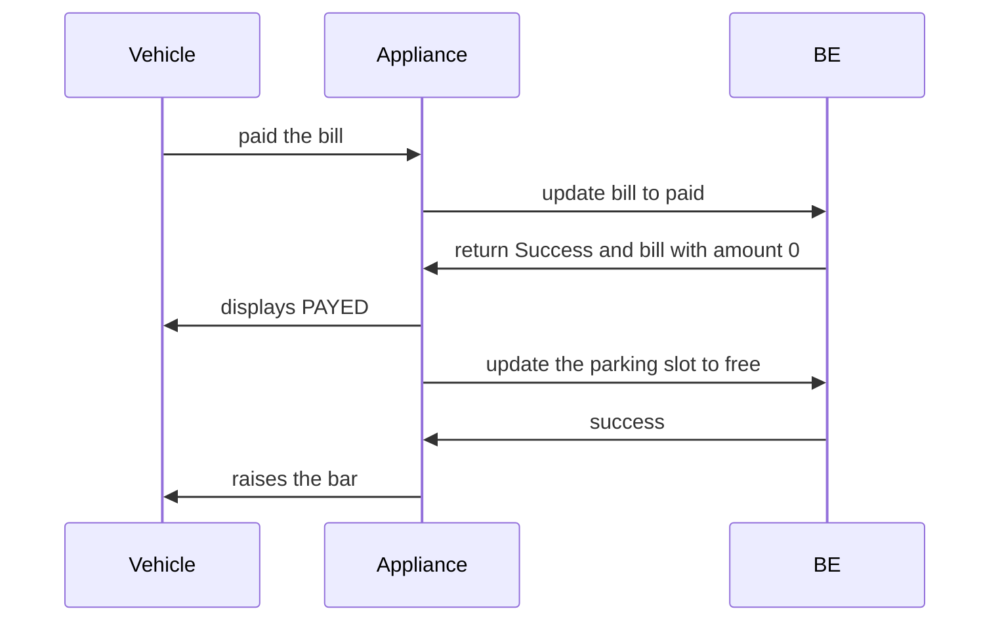

# Toll Parking API
This project is a Toll Parking REST API  server sample. The project provides REST API endpoints that could be used by the client ( an example of a client is a toll parking appliance).

## Installation and running the project
### On Windows
The application requires:
- Java 15
- Apache Maven 3.6.3

Be sure to have them installed and that both Java and Maven have their environment variable set.
- Clone or download the project from GitHub: [here](https://github.com/adigirolamo/parkingtoll/tree/main)
- Run GitBash and go to the folder where you have cloned the project
- Run the following command:
```
./mvnw clean package spring-boot:repackage
```
- When the build is completed run:
```
java -jar ./target/parkingtoll-1.0.0.jar
```
In case of error it is possible to analyze the logs in *./logs* . The application uses the port 8080, therefore check that is not already in use.

## Useful links
### REST API endpoints documentation
- http://localhost:8080/swagger-ui.html

REST API endpoints have been documented using swagger. It's possible to access the interactive documentation via the above link,  while the project is running.

### Database console
- http://localhost:8080/h2-console
	- Driver Class: org.h2.Driver
	- JDBC URL: jdbc:h2:mem:mydb
	- username: sa
	- password: sa

It has been used H2 has Database. While the project is running it is possible to access the DB console via the above link and credentials.

## Overview
The project is a Toll Parking REST API server sample. 
The application manages more than one toll parking.
Each toll parking contains multiple parking slots of different types:
- the standard parking slots for sedan cars (gasoline-powered)
- parking slots with 20kw power supply for electric cars
- parking slots with 50kw power supply for electric cars

**Note**: 20kw electric cars cannot use 50kw power supplies and vice-versa

The application provides four API endpoints that could be used by clients (an example of a client is a Toll Parking appliance) to:
#### Get a free parking slot
 Get a free parking slot for the incoming vehicle and assign it to the vehicle. The slot is assigned by vehicle *engines type*. If there isn't any free slot (of the right type) left, the vehicle will be refused (the api returns an error,  [check swagger doc](http://localhost:8080/swagger-ui.html))

The appliance (client) must send:
-  the toll parking that it is requesting the parking slot from
- the vechile engine type
- the vehicle plate

#### Get vehicle bill
The BE will calculate the amount that the vehicle has to pay and it will return it. **The bill calculation is based on the time that the vehicle has occupied the slot and the pricing strategy that the Toll parking has set**. Two strategies are supported: 
	- Price per minutes * time spent
	- Fixed amount plus price per minutes * time spent 
#### Update vehicle bill status to PAID
The appliance notificates the BE that the bill has been paid.
#### Update the parking slot to free
The appliance notificates the BE that is has to update the parking slot, that was used by the vehicle, to free (raise the bar!)

### Parking slot state concept
An important concept to note is that the events described above have been managed introducing a state strategy. A parking slot has 4 different state:
- free
- reserved
- paying
- paid

Each event above changes the parking slot from its actual state to the one related to the event:
1. [get free parking slot](#get-a-free-parking-slot) changes parking slot state from *free* to *reserved*.
2. [get vehicle bill](#get-vehicle-bill) changes parking slot state from *reserved* to *paying*
3. [update vehicle bill status to paid](#update-vehicle-bill-status-to-paid) changes parking slot state from *paying* to *paid*
4. [update the parking slot to free](#update-the-parking-slot-to-free) changes the parking slot state from *paid* to *free*

A parking slot from one state can go only to next state accepted by the actual state, otherwise an exception will be raised. 
Based on the new state, there is a concrete implementation, for each entity, that changes the entity values to be consistents with the new stage.
[State Service](https://github.com/adigirolamo/parkingtoll/blob/documentation/src/main/java/com/adigi/parkingtoll/service/state/ParkingSlotStateService.java)

### What has been used
The project uses:
- Java 15
- Apache Maven 3.6.3
- Spring Boot 2.4.1
	- Spring Boot data jdbc
	- Spring Boot web
	- Spring Boot validation
	- Spring Boot data jpa
	- Spring Boot test
	- Spring restdocs mockmvc
	- Springdoc openapi
- h2
- lombok

### Functional description
##### Incoming vehicle
An incoming vehicle arrives to the toll parking *Parking1*. *Parking1*'s appliance recognizes the vehicle's plate, it requests the vehicle engine type to and external Statal Vechiles API and [it requests a free parking slot for the vehicle](#get-a-free-parking-slot) to the BE. The slot is request targeting an engine type.
If there is an available slot the BE returns the available slot to the appliance and the appliance displays it to the vechile. The vehicle enters.

##### Vehicle asks the bill
[Get vehicle bill](#get-vehicle-bill)

##### Vehicle pays the bill AND appliance raises the bar
[Update-vehicle-bill-status-to-paid](#update-vehicle-bill-status-to-paid)
[Update the parking slot to free](#update-the-parking-slot-to-free)


### Database Entities
TODO

## Code
TODO

### Sequence diagram
TODO

### Error handling
TODO

### Code POI
TODO

### Test
TODO


## References
https://springdoc.org/
https://swagger.io/docs/specification/adding-examples/